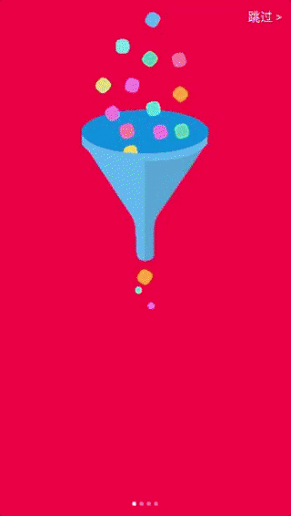

# banner

   

## 功能

引导页、循环广告栏

## 使用

```groovy
compile 'com.rolyyu:banner:1.0.0'
```

### 1.在布局文件中添加Banner

```xml
<com.roly.banner.Banner
    android:id="@+id/banner"
    android:layout_width="match_parent"
    android:layout_height="200dp" />
```

### 2.初始化

```java
/**
 * 设置自定义布局、数据大小、适配器
 *
 * @param layoutResId 自定义item布局
 * @param isCyclePlay 是否循环播放
 * @param dataSize    数据大小
 * @param adapter     适配器接口
 */
public void setAdapter(@LayoutRes int layoutResId, boolean isCyclePlay, int dataSize, Adapter adapter)
```

适配器接口只需完成item数据的填充：

```java
public interface Adapter {
    void fillBannerItem(View view, int position);
}
```

**e.g.**

(1).自定义布局**R.layout.item_banner**：

```xml
<?xml version="1.0" encoding="utf-8"?>
<RelativeLayout xmlns:android="http://schemas.android.com/apk/res/android"
    xmlns:app="http://schemas.android.com/apk/res-auto"
    android:id="@+id/rl_banner"
    android:layout_width="match_parent"
    android:layout_height="match_parent">

    <ImageView
        android:id="@+id/img_banner"
        android:layout_width="match_parent"
        android:layout_height="match_parent"
        android:scaleType="centerCrop" />

</RelativeLayout>
```

(2).实体类：

```java
public class BannerBean {

    private String image;

    public String getImage() {
        return image;
    }

    public void setImage(String image) {
        this.image = image;
    }
}
```

(3).设置适配器：

注意 ： 一定是`view.findViewById()`

```java
banner.setAdapter(R.layout.item_banner, bannerBeans.size(), new Banner.Adapter() {
	@Override
    public void fillBannerItem(View view, final int position) {
    	//填充数据
        ImageView imageView = (ImageView) view.findViewById(R.id.img_banner);
        ImageUtil.load(MainActivity.this, imageView, bannerBeans.get(position).getImage());
               
        //设置单击事件
        view.setOnClickListener(new View.OnClickListener() {
        	@Override
            public void onClick(View v) {
                   Toast.makeText(MainActivity.this,"item"+position+"click",Toast.LENGTH_SHORT).show();
            }
        });
     }
 });
```

### 3.属性

#### 设置自动轮播

```java
/**
 * 是否自动播放
 * @param isAutoPlay 默认false
 */
public void setIsAutoPlay(boolean isAutoPlay)
```
#### 设置指示器

可以使用默认指示器，也可以按照需求设置自定义样式，可以单独设置指示器的资源文件、大小和间距。

```java
/**
 * 设置指示器
 * @param indicatorWidth 指示器宽度
 * @param indicatorHeight 指示器高度
 * @param indicatorInterval 指示器间距
 */
 public void setIndicators(int indicatorWidth,int indicatorHeight,int indicatorInterval)

```

```java
/**
 * 设置指示器
 * @param indicatorNormalRes 未选中状态图标
 * @param indicatorSelectedRes 选中状态图标
 */
 public void setIndicators(@DrawableRes int indicatorNormalRes,@DrawableRes int indicatorSelectedRes)

```

```java
/**
 * 设置指示器
 * @param indicatorNormalRes 未选中状态图标
 * @param indicatorSelectedRes 选中状态图标
 * @param indicatorWidth 指示器宽度
 * @param indicatorHeight 指示器高度
 * @param indicatorInterval 指示器间距
 */
 public void setIndicators(@DrawableRes int indicatorNormalRes,@DrawableRes int indicatorSelectedRes,int indicatorWidth,int indicatorHeight,int indicatorInterval)
 
```