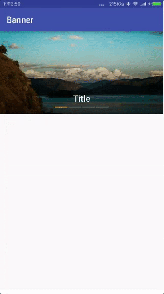

# banner

 

 ## 功能

循环广告栏

## 基本使用

### 1.在布局文件中添加Banner

```xml
<edu.jnu.banner.Banner
        android:id="@+id/banner"
        android:layout_width="match_parent"
        android:layout_height="200dp" />
```

### 2.初始化

```java
	/**
     * 设置资源文件、数据大小、适配器
     *
     * @param layoutResId  //设置自定义布局文件，不包含指示器
     * @param dataSize //数据大小
     * @param adapter //填充数据
     */
    public void setAdapter(@LayoutRes int layoutResId, int dataSize, Adapter adapter); 
```

e.g.：

```java
banner.setAdapter(R.layout.item_banner, bannerBeans.size(), new Banner.Adapter() {
	@Override
    public void fillBannerItem(View view, final int position) {
    	//填充数据
        ImageView imageView = (ImageView) view.findViewById(R.id.img_banner);
        ImageUtil.load(MainActivity.this, imageView, bannerBean.getImage());
               
        //设置单击事件
        view.setOnClickListener(new View.OnClickListener() {
        	@Override
            public void onClick(View v) {
                    	           Toast.makeText(MainActivity.this,"item"+position+"click",Toast.LENGTH_SHORT).show();
            }
        });
     }
 });
```

### 3.属性

```
//设置是否自动轮播
banner.setIsAutoPlay(false);
```